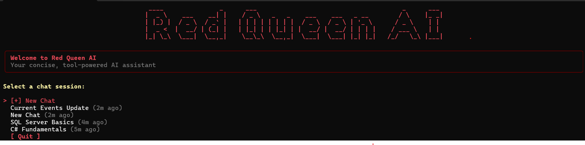
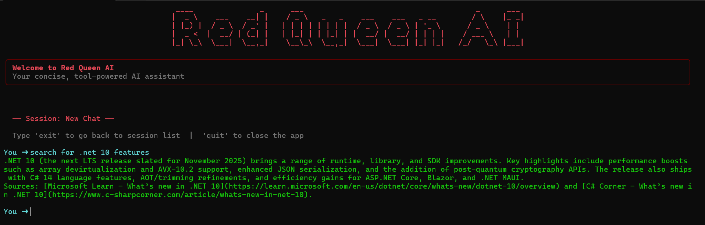

<p align="center">
  
</p>

[](https://dotnet.microsoft.com/)
[](https://github.com/microsoft/semantic-kernel)
[](https://www.microsoft.com/sql-server)
[](https://groq.com/)
[](LICENSE)

A high-performance, token-efficient AI assistant for the Windows terminal built on **.NET 10** and **Microsoft Semantic Kernel**. Features multi-session chat memory, live DuckDuckGo web search with citations, live SQL Server management, mathematical expression evaluation, real-time date/time calculations, and a copy-friendly Markdown terminal renderer.

---

## Screenshots

### Session Selection Interface

> Interactive menu powered by Spectre.Console with real-time relative timestamps and AI session titles.



### Live Chat & Real-Time Web Search

> Instant token streaming, clean Markdown rendering, and live DuckDuckGo web search with cited source links.



---

## Features & Plugins

| Plugin                     | Capabilities & Methods                                                                                                                                                                                                                                                                                                                                                                                                                                                                          |
| -------------------------- | ----------------------------------------------------------------------------------------------------------------------------------------------------------------------------------------------------------------------------------------------------------------------------------------------------------------------------------------------------------------------------------------------------------------------------------------------------------------------------------------------- |
| **WebSearchPlugin**        | • Dual-engine search: **DuckDuckGo** (with cookie session handling) + **Wikipedia API** fallback<br>• Real-time web search for news, current events, software updates, facts<br>• Extracts clean titles, direct URLs, and formatted summaries with citations                                                                                                                                                                                                                                    |
| **DatabasePlugin**         | • `CreateDatabase(name)` — creates new SQL Server databases<br>• `CreateTable(db, table, cols)` — creates tables with typed columns, nullability, and primary/identity keys<br>• `ListDatabases()` — lists all non-system databases on the server<br>• `ListTables(db)` — shows all tables in any database<br>• `DescribeTable(db, table)` — inspects schema (column types, nullability, identity)<br>• `ExecuteSelectQuery(db, query)` — safely executes read-only queries into an ASCII table |
| **MathPlugins**            | • `EvaluateExpression(expr)` — full arithmetic evaluator for `+`, `-`, `*`, `/`, `%`, `^`, parentheses, and decimals<br>• `Power(base, exp)` — calculates exponentiation (e.g. `2^8` = `256`)<br>• `SquareRoot(n)` — square root of any non-negative number (`sqrt of 144` = `12`)<br>• `Percentage(pct, total)` — calculates percentage (`18% of 500` = `90`)<br>• `Modulus(a, b)` — remainder calculation (`17 % 5` = `2`)                                                                    |
| **DatePlugin**             | • `CurrentDateTime()` — full date and time<br>• `CurrentDate()` — formatted date<br>• `CurrentTime()` — formatted time (`hh:mm:ss tt`)<br>• `DayOfWeek()` — day of the week (e.g. `Sunday`)<br>• `DaysBetween(d1, d2)` — calculates days between any two dates<br>• `AddDays(n)` — calculates future or past dates ($N$ days)                                                                                                                                                                   |
| **Chat Sessions**          | • Multi-session management with Spectre.Console interactive menu<br>• AI auto-generated 2–4 word session titles (reasoning-model compatible)<br>• Algorithmic fallback title generation so sessions are never left untitled<br>• Database startup self-repair for legacy untitled chats                                                                                                                                                                                                         |
| **Terminal UI & Streamer** | • Token-by-token streaming with animated braille spinner<br>• Clean cyan inline code without literal backtick characters<br>• Copy-friendly code blocks with top/bottom separators and **no side border characters**                                                                                                                                                                                                                                                                            |

---

## Project Structure

```
ConsoleChatBot/
├── AiChatBot/
│   ├── Program.cs                   # Entry point, outer session loop, chat REPL
│   ├── AiChatBot.csproj             # .NET 10 project definition & dependencies
│   │
│   ├── Models/
│   │   └── DatabasePlan.cs          # DTO for AI database operations & schemas
│   │
│   ├── Plugins/
│   │   ├── DatabasePlugin.cs        # SQL Server DDL, inspection, and query tool
│   │   ├── Date.cs                  # Date & time operations & calculations
│   │   ├── MathPlugin.cs            # Mathematical expressions & scientific tools
│   │   └── WebSearch.cs             # Dual-engine DuckDuckGo & Wikipedia search
│   │
│   ├── Services/
│   │   ├── ChatMemoryService.cs     # Save/load messages per session (SQL Server)
│   │   ├── ChatSessionService.cs    # CRUD & table bootstrap for ChatSessions
│   │   ├── TitleGenerator.cs        # AI title generator with reasoning support
│   │   └── ToolRouter.cs            # Heuristic intent router + tool dispatcher
│   │
│   └── UI/
│       ├── CodeBlockRenderer.cs     # Syntax-highlighted, copyable code blocks
│       ├── Loading.cs               # Async braille spinner animation
│       ├── MarkdownStreamRenderer.cs# Streaming Markdown parser for console
│       └── SessionSelector.cs       # Spectre.Console session picker UI
│
├── Images/
│   ├── Interface.png                # Screenshot of session selector menu
│   └── Chat.png                     # Screenshot of live chat & web search
│
├── LICENSE                          # MIT License
└── README.md
```

---

## SQL Server Setup

The application **auto-creates all required tables on startup** using `EnsureTableExistsAsync()` and `EnsureTablesExistAsync()`. No manual SQL scripts are required.

```sql
-- Stores named chat sessions
CREATE TABLE ChatSessions (
    Id        INT PRIMARY KEY IDENTITY(1,1),
    Title     NVARCHAR(100) NOT NULL DEFAULT 'New Chat',
    CreatedAt DATETIME      NOT NULL DEFAULT GETDATE()
);

-- Stores individual messages linked to a session
CREATE TABLE ChatMessages (
    Id        INT PRIMARY KEY IDENTITY(1,1),
    Role      VARCHAR(20)   NOT NULL,         -- 'user' or 'assistant'
    Message   NVARCHAR(MAX) NOT NULL,
    CreatedAt DATETIME      DEFAULT GETDATE(),
    SessionId INT NULL REFERENCES ChatSessions(Id) ON DELETE CASCADE
);
```

---

## Configuration (User Secrets)

API keys and connection strings are managed securely via `.NET User Secrets`:

```bash
cd AiChatBot

# Set SQL Server connection string
dotnet user-secrets set "ConnectionStrings:RedQueenDb" "Server=YOUR_SERVER,1433;Database=RedQueenAi;Trusted_Connection=True;TrustServerCertificate=True;"

# Set Groq / OpenAI-compatible API key
dotnet user-secrets set "Api:key" "YOUR_API_KEY"
```

---

## In-Chat Commands & Intent Triggers

| Prompt Example                                                  | Handled By          | Action                                 |
| --------------------------------------------------------------- | ------------------- | -------------------------------------- |
| `"search for .NET 10 features"`                                 | **WebSearchPlugin** | Live DuckDuckGo search + cited links   |
| `"what is current events going on?"`                            | **WebSearchPlugin** | Live global news headlines & summaries |
| `"what is (15 * 4) + (100 / 5) - 2.5"`                          | **MathPlugins**     | Direct expression evaluation (`77.5`)  |
| `"what is 2^8"` / `"sqrt of 144"`                               | **MathPlugins**     | Scientific calculation (`256`, `12`)   |
| `"what time is it"` / `"today's date"`                          | **DatePlugin**      | Real-time system clock query           |
| `"what day is it"` / `"days between 2026-01-01 and 2026-12-31"` | **DatePlugin**      | Day of week / date span calculation    |
| `"list all databases"`                                          | **DatabasePlugin**  | Lists user databases on SQL Server     |
| `"show tables in RedQueenAi"`                                   | **DatabasePlugin**  | Lists all tables in specified database |
| `"describe table ChatSessions in RedQueenAi"`                   | **DatabasePlugin**  | Formatted column schema & PK info      |
| `"create table products with id, name, price in ShopDB"`        | **DatabasePlugin**  | AI JSON DDL planner & table creation   |
| `"exit"`                                                        | **Session Loop**    | Returns to session selector menu       |
| `"quit"`                                                        | **Application**     | Gracefully closes the application      |

---

## Future Improvements

- [ ] **File Reading Plugin** — Allow the chatbot to inspect, read, and explain local codebase files.
- [ ] **System Diagnostics Plugin** — Query machine health (RAM usage, CPU, free disk space, OS build, .NET runtime).
- [ ] **Session Management Submenu** — Delete or manually rename sessions directly within Spectre.Console.
- [ ] **Export to Markdown** — Command like `/export` to save the active conversation as a `.md` file.

---

## License

This project is licensed under the **MIT License** — see the [LICENSE](LICENSE) file for details.

---

## Author

**Tanish Gupta**  
GitHub: [@Tanish15-gif](https://github.com/Tanish15-gif)
